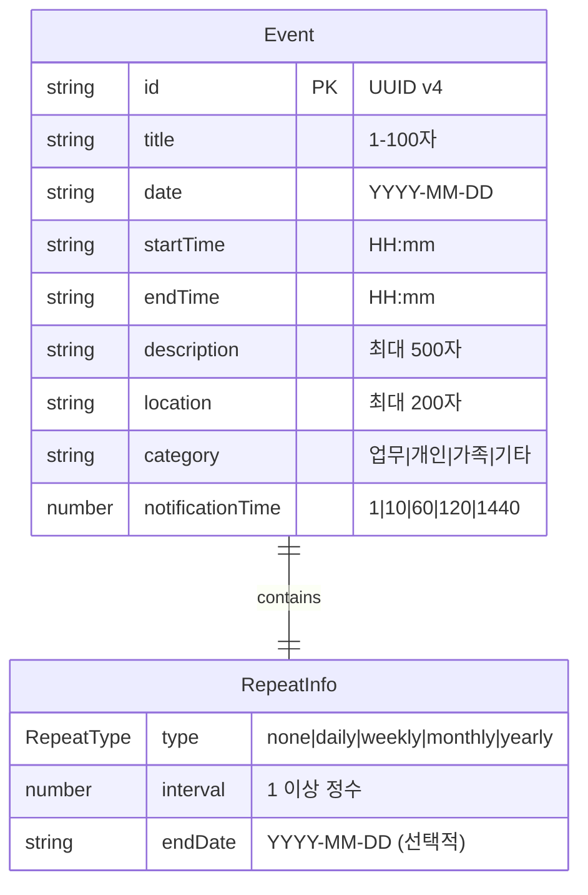

# 01. 데이터 모델 명세

**문서 버전**: 1.0.0
**최종 업데이트**: 2025-10-27

---

## 📋 목차

1. [개요](#개요)
2. [핵심 타입 정의](#핵심-타입-정의)
3. [타입별 상세 명세](#타입별-상세-명세)
4. [데이터 관계 다이어그램](#데이터-관계-다이어그램)
5. [타입 변환 규칙](#타입-변환-규칙)
6. [예시 데이터](#예시-데이터)

---

## 개요

### 문서 목적

이 문서는 일정 관리 시스템의 모든 데이터 구조를 정의합니다. AI가 이 명세를 읽고 올바른 타입 정의와 데이터 처리 로직을 생성할 수 있도록 각 필드의 의미, 제약사항, 예시를 상세히 기술합니다.

### 타입 시스템

- **언어**: TypeScript 5.2+
- **스타일**: Strict 모드 사용
- **네이밍**: PascalCase for types, camelCase for fields
- **파일 위치**: `src/types.ts`

---

## 핵심 타입 정의

### 타입 계층 구조

```
RepeatType (유니온 타입)
    ↓
RepeatInfo (인터페이스)
    ↓
EventForm (인터페이스) ──→ API 요청 시 사용
    ↓
Event (인터페이스) ──→ 서버 응답 및 클라이언트 상태 관리
```

### 타입 소스 코드

```typescript
// src/types.ts

/**
 * 반복 일정 유형
 * - none: 반복 없음 (일반 일정)
 * - daily: 매일 반복
 * - weekly: 매주 반복
 * - monthly: 매월 반복
 * - yearly: 매년 반복
 */
export type RepeatType = 'none' | 'daily' | 'weekly' | 'monthly' | 'yearly';

/**
 * 반복 일정 상세 정보
 */
export interface RepeatInfo {
  /** 반복 유형 */
  type: RepeatType;

  /** 반복 간격 (예: 2이면 격주) */
  interval: number;

  /** 반복 종료 날짜 (선택적, ISO 8601 형식: YYYY-MM-DD) */
  endDate?: string;
}

/**
 * 일정 생성/수정 시 사용하는 폼 데이터
 * id가 없는 버전 (서버가 생성)
 */
export interface EventForm {
  /** 일정 제목 (필수, 1-100자) */
  title: string;

  /** 일정 날짜 (필수, ISO 8601 형식: YYYY-MM-DD) */
  date: string;

  /** 시작 시간 (필수, 24시간 형식: HH:mm) */
  startTime: string;

  /** 종료 시간 (필수, 24시간 형식: HH:mm) */
  endTime: string;

  /** 일정 설명 (선택적, 최대 500자) */
  description: string;

  /** 일정 위치 (선택적, 최대 200자) */
  location: string;

  /** 일정 카테고리 (필수, '업무' | '개인' | '가족' | '기타') */
  category: string;

  /** 반복 설정 */
  repeat: RepeatInfo;

  /** 알림 시간 (분 단위, 예: 10 = 10분 전) */
  notificationTime: number;
}

/**
 * 일정 엔티티 (서버에서 관리하는 전체 데이터)
 * EventForm에 id를 추가한 버전
 */
export interface Event extends EventForm {
  /** 고유 식별자 (서버 생성, UUID v4 형식) */
  id: string;
}
```

---

## 타입별 상세 명세

### 1. RepeatType

#### 정의
```typescript
type RepeatType = 'none' | 'daily' | 'weekly' | 'monthly' | 'yearly';
```

#### 각 값의 의미

| 값 | 의미 | 사용 예시 |
|---|------|----------|
| `'none'` | 반복 없음 | 일회성 회의, 단발성 이벤트 |
| `'daily'` | 매일 반복 | 매일 아침 운동, 일일 스탠드업 |
| `'weekly'` | 매주 반복 | 주간 회의, 주말 활동 |
| `'monthly'` | 매월 반복 | 월간 보고, 월급날 |
| `'yearly'` | 매년 반복 | 생일, 기념일, 연간 행사 |

#### 제약사항
- 반드시 위 5개 값 중 하나여야 함
- 대소문자 구분 (모두 소문자)
- 빈 문자열이나 null 불가

#### 기본값
```typescript
const defaultRepeatType: RepeatType = 'none';
```

---

### 2. RepeatInfo

#### 정의
```typescript
interface RepeatInfo {
  type: RepeatType;
  interval: number;
  endDate?: string;
}
```

#### 필드별 상세

##### `type: RepeatType`
- **필수 여부**: 필수
- **설명**: 반복 유형을 지정
- **유효한 값**: RepeatType 참조
- **예시**: `'daily'`, `'weekly'`, `'none'`

##### `interval: number`
- **필수 여부**: 필수
- **설명**: 반복 간격 (단위는 type에 따라 다름)
- **유효한 값**: 양의 정수 (1 이상)
- **제약사항**:
  - 최소값: 1
  - 최대값: 100 (실용적 범위)
  - 정수만 허용 (소수점 불가)
- **동작**:
  - `type: 'daily'`, `interval: 1` → 매일
  - `type: 'daily'`, `interval: 2` → 이틀에 한 번
  - `type: 'weekly'`, `interval: 2` → 격주
  - `type: 'monthly'`, `interval: 3` → 3개월마다
- **예시**:
  ```typescript
  { type: 'weekly', interval: 1 }  // 매주
  { type: 'monthly', interval: 2 } // 격월
  ```

##### `endDate?: string`
- **필수 여부**: 선택적
- **설명**: 반복이 종료되는 날짜
- **형식**: ISO 8601 (YYYY-MM-DD)
- **제약사항**:
  - `undefined` 또는 유효한 날짜 문자열
  - 일정 시작 날짜보다 이후여야 함
  - `undefined`면 무한 반복
- **예시**:
  ```typescript
  { type: 'daily', interval: 1, endDate: '2025-12-31' }  // 2025년 말까지 매일
  { type: 'weekly', interval: 1, endDate: undefined }    // 무한 반복
  ```

#### 유효성 검증 규칙

```typescript
function validateRepeatInfo(repeat: RepeatInfo): boolean {
  // 1. interval은 1 이상의 정수
  if (repeat.interval < 1 || !Number.isInteger(repeat.interval)) {
    return false;
  }

  // 2. type이 'none'이면 interval은 무시됨 (기본값 0 또는 1)
  // 3. endDate가 있으면 유효한 날짜 형식인지 확인
  if (repeat.endDate && !/^\d{4}-\d{2}-\d{2}$/.test(repeat.endDate)) {
    return false;
  }

  return true;
}
```

#### 기본값
```typescript
const defaultRepeatInfo: RepeatInfo = {
  type: 'none',
  interval: 1,
  endDate: undefined
};
```

---

### 3. EventForm

#### 정의
```typescript
interface EventForm {
  title: string;
  date: string;
  startTime: string;
  endTime: string;
  description: string;
  location: string;
  category: string;
  repeat: RepeatInfo;
  notificationTime: number;
}
```

#### 필드별 상세

##### `title: string`
- **필수 여부**: 필수
- **설명**: 일정의 제목
- **제약사항**:
  - 최소 길이: 1자
  - 최대 길이: 100자
  - 빈 문자열 불가
  - 공백만으로 구성 불가
- **예시**:
  ```typescript
  "팀 회의"
  "점심 약속 - 홍길동"
  "2025 Q1 전략 회의"
  ```

##### `date: string`
- **필수 여부**: 필수
- **설명**: 일정이 발생하는 날짜
- **형식**: ISO 8601 (YYYY-MM-DD)
- **제약사항**:
  - 정규식: `/^\d{4}-\d{2}-\d{2}$/`
  - 유효한 날짜여야 함 (예: 2025-02-30은 불가)
  - 과거 날짜도 허용
- **예시**:
  ```typescript
  "2025-10-27"
  "2025-12-25"
  "2024-01-01"
  ```

##### `startTime: string`
- **필수 여부**: 필수
- **설명**: 일정 시작 시간
- **형식**: 24시간제 (HH:mm)
- **제약사항**:
  - 정규식: `/^\d{2}:\d{2}$/`
  - 시간 범위: 00:00 ~ 23:59
  - endTime보다 빨라야 함
- **예시**:
  ```typescript
  "09:00"
  "14:30"
  "23:45"
  ```

##### `endTime: string`
- **필수 여부**: 필수
- **설명**: 일정 종료 시간
- **형식**: 24시간제 (HH:mm)
- **제약사항**:
  - 정규식: `/^\d{2}:\d{2}$/`
  - 시간 범위: 00:00 ~ 23:59
  - startTime보다 늦어야 함
  - startTime과 같을 수 없음
- **예시**:
  ```typescript
  "10:00"
  "15:30"
  "23:59"
  ```

##### `description: string`
- **필수 여부**: 선택적 (빈 문자열 허용)
- **설명**: 일정에 대한 상세 설명
- **제약사항**:
  - 최대 길이: 500자
  - 빈 문자열 허용
- **예시**:
  ```typescript
  ""  // 설명 없음
  "Q1 목표 달성 현황 및 Q2 계획 논의"
  "참석자: 팀 전체, 장소: 대회의실"
  ```

##### `location: string`
- **필수 여부**: 선택적 (빈 문자열 허용)
- **설명**: 일정이 열리는 장소
- **제약사항**:
  - 최대 길이: 200자
  - 빈 문자열 허용
- **예시**:
  ```typescript
  ""  // 장소 없음
  "회의실 A"
  "서울시 강남구 테헤란로 123"
  "Zoom 링크: https://zoom.us/j/123456"
  ```

##### `category: string`
- **필수 여부**: 필수
- **설명**: 일정 카테고리
- **유효한 값**: `'업무'` | `'개인'` | `'가족'` | `'기타'`
- **제약사항**:
  - 반드시 위 4개 값 중 하나
  - 대소문자 정확히 일치해야 함
- **기본값**: `'업무'`
- **예시**:
  ```typescript
  "업무"  // 회의, 프로젝트 등
  "개인"  // 운동, 취미 등
  "가족"  // 가족 행사, 모임 등
  "기타"  // 분류하기 애매한 것들
  ```

##### `repeat: RepeatInfo`
- **필수 여부**: 필수
- **설명**: 반복 일정 설정
- **기본값**: `{ type: 'none', interval: 1 }`
- **참조**: RepeatInfo 타입 참조
- **예시**:
  ```typescript
  { type: 'none', interval: 1 }           // 반복 없음
  { type: 'weekly', interval: 1 }         // 매주
  { type: 'daily', interval: 2, endDate: '2025-12-31' }  // 격일, 2025년까지
  ```

##### `notificationTime: number`
- **필수 여부**: 필수
- **설명**: 일정 시작 전 몇 분 전에 알림을 보낼지 설정
- **단위**: 분 (minutes)
- **유효한 값**: `1` | `10` | `60` | `120` | `1440`
- **의미**:
  - `1`: 1분 전
  - `10`: 10분 전
  - `60`: 1시간 전 (60분)
  - `120`: 2시간 전 (120분)
  - `1440`: 1일 전 (24시간 = 1440분)
- **기본값**: `10`
- **제약사항**:
  - 반드시 위 5개 값 중 하나
  - 음수 불가
- **예시**:
  ```typescript
  10    // 10분 전 알림
  60    // 1시간 전 알림
  1440  // 1일 전 알림
  ```

#### 전체 예시

```typescript
const exampleEventForm: EventForm = {
  title: '팀 회의',
  date: '2025-10-27',
  startTime: '14:00',
  endTime: '15:00',
  description: 'Q4 프로젝트 진행 상황 리뷰',
  location: '회의실 B',
  category: '업무',
  repeat: {
    type: 'weekly',
    interval: 1,
    endDate: '2025-12-31'
  },
  notificationTime: 10
};
```

---

### 4. Event

#### 정의
```typescript
interface Event extends EventForm {
  id: string;
}
```

#### 필드별 상세

##### `id: string`
- **필수 여부**: 필수 (서버가 생성)
- **설명**: 일정의 고유 식별자
- **형식**: UUID v4
- **제약사항**:
  - 서버에서만 생성 (클라이언트는 생성 불가)
  - 중복 불가
  - 형식: `xxxxxxxx-xxxx-4xxx-yxxx-xxxxxxxxxxxx`
- **예시**:
  ```typescript
  "123e4567-e89b-12d3-a456-426614174000"
  "f47ac10b-58cc-4372-a567-0e02b2c3d479"
  ```

#### 전체 예시

```typescript
const exampleEvent: Event = {
  id: '123e4567-e89b-12d3-a456-426614174000',
  title: '팀 회의',
  date: '2025-10-27',
  startTime: '14:00',
  endTime: '15:00',
  description: 'Q4 프로젝트 진행 상황 리뷰',
  location: '회의실 B',
  category: '업무',
  repeat: {
    type: 'weekly',
    interval: 1,
    endDate: '2025-12-31'
  },
  notificationTime: 10
};
```

---

## 데이터 관계 다이어그램



### 관계 설명

- Event는 정확히 하나의 RepeatInfo를 가짐
- RepeatInfo는 Event에 embedded됨 (별도 테이블 아님)
- Event는 EventForm을 확장하며 id 필드만 추가

---

## 타입 변환 규칙

### 1. EventForm → Event (서버 생성 시)

```typescript
function createEventFromForm(form: EventForm): Event {
  return {
    id: generateUUID(),  // 서버에서 생성
    ...form
  };
}
```

**시나리오**: 사용자가 새 일정을 생성할 때
- 입력: EventForm (id 없음)
- 서버 동작: UUID 생성하여 id 추가
- 출력: Event (id 포함)

### 2. Event → EventForm (수정 시)

```typescript
function eventToForm(event: Event): EventForm {
  const { id, ...form } = event;
  return form;
}
```

**시나리오**: 기존 일정을 수정할 때
- 입력: Event (id 포함)
- 클라이언트 동작: id 제거
- API 호출: EventForm 전송 (URL에 id 포함: PUT /api/events/:id)

### 3. 부분 업데이트 (Partial Event)

```typescript
type PartialEventUpdate = Partial<Omit<Event, 'id'>>;

function updateEvent(id: string, updates: PartialEventUpdate): Event {
  const current = getEventById(id);
  return {
    ...current,
    ...updates
  };
}
```

**시나리오**: 일정의 일부 필드만 수정할 때
- 입력: 변경할 필드만 포함한 객체
- 서버 동작: 기존 데이터와 병합
- 출력: 전체 Event

---

## 예시 데이터

### 예시 1: 일반 일정 (반복 없음)

```typescript
const singleEvent: Event = {
  id: 'a1b2c3d4-e5f6-4a5b-9c8d-7e6f5a4b3c2d',
  title: '치과 예약',
  date: '2025-11-15',
  startTime: '10:00',
  endTime: '11:00',
  description: '정기 검진',
  location: '서울치과의원',
  category: '개인',
  repeat: {
    type: 'none',
    interval: 1
  },
  notificationTime: 60  // 1시간 전 알림
};
```

### 예시 2: 매주 반복 일정

```typescript
const weeklyEvent: Event = {
  id: 'b2c3d4e5-f6a7-4b5c-9d8e-7f6a5b4c3d2e',
  title: '주간 팀 회의',
  date: '2025-10-28',  // 월요일
  startTime: '09:00',
  endTime: '10:00',
  description: '주간 업무 공유 및 계획',
  location: 'Zoom',
  category: '업무',
  repeat: {
    type: 'weekly',
    interval: 1,
    endDate: '2025-12-31'
  },
  notificationTime: 10  // 10분 전 알림
};
```

### 예시 3: 격일 반복 일정

```typescript
const alternateDayEvent: Event = {
  id: 'c3d4e5f6-a7b8-4c5d-9e8f-7a6b5c4d3e2f',
  title: '아침 운동',
  date: '2025-11-01',
  startTime: '06:00',
  endTime: '07:00',
  description: '헬스장 운동',
  location: '피트니스 센터',
  category: '개인',
  repeat: {
    type: 'daily',
    interval: 2  // 격일
  },
  notificationTime: 1440  // 1일 전 알림
};
```

### 예시 4: 연간 반복 일정

```typescript
const yearlyEvent: Event = {
  id: 'd4e5f6a7-b8c9-4d5e-9f8a-7b6c5d4e3f2a',
  title: '결혼기념일',
  date: '2025-06-15',
  startTime: '18:00',
  endTime: '21:00',
  description: '배우자와 특별한 저녁',
  location: '레스토랑',
  category: '가족',
  repeat: {
    type: 'yearly',
    interval: 1
  },
  notificationTime: 1440  // 1일 전 알림
};
```

### 예시 5: 최소 필드 (필수만)

```typescript
const minimalEvent: Event = {
  id: 'e5f6a7b8-c9d0-4e5f-9a8b-7c6d5e4f3a2b',
  title: '간단한 메모',
  date: '2025-11-20',
  startTime: '15:00',
  endTime: '15:30',
  description: '',  // 빈 문자열
  location: '',     // 빈 문자열
  category: '기타',
  repeat: {
    type: 'none',
    interval: 1
  },
  notificationTime: 10
};
```

---

## 타입 가드 함수

### isEvent vs isEventForm

```typescript
/**
 * Event 타입인지 확인 (id 존재 여부로 판단)
 */
function isEvent(data: Event | EventForm): data is Event {
  return 'id' in data && typeof data.id === 'string';
}

/**
 * EventForm 타입인지 확인
 */
function isEventForm(data: Event | EventForm): data is EventForm {
  return !('id' in data);
}
```

### 사용 예시

```typescript
function saveOrUpdate(data: Event | EventForm) {
  if (isEvent(data)) {
    // data는 Event 타입
    return updateEvent(data.id, data);
  } else {
    // data는 EventForm 타입
    return createEvent(data);
  }
}
```

---

## 불변성 규칙

### 읽기 전용 필드

- `id`: 생성 후 변경 불가
- `repeat.type`: 반복 유형 변경 시 새 일정 시리즈 생성 권장

### 변경 가능 필드

- `title`, `date`, `startTime`, `endTime`: 자유롭게 수정 가능
- `description`, `location`, `category`: 자유롭게 수정 가능
- `repeat.interval`, `repeat.endDate`: 수정 가능 (주의 필요)
- `notificationTime`: 자유롭게 수정 가능

---

## TypeScript 타입 체크 예시

```typescript
// ✅ 올바른 예시
const validEvent: Event = {
  id: '123e4567-e89b-12d3-a456-426614174000',
  title: '회의',
  date: '2025-10-27',
  startTime: '14:00',
  endTime: '15:00',
  description: '',
  location: '',
  category: '업무',
  repeat: { type: 'none', interval: 1 },
  notificationTime: 10
};

// ❌ 컴파일 에러: id 누락
const invalidEvent: Event = {
  title: '회의',
  // ... 기타 필드
};

// ❌ 컴파일 에러: category 값 오류
const invalidCategory: Event = {
  id: '...',
  category: '회사',  // '업무', '개인', '가족', '기타'만 허용
  // ... 기타 필드
};

// ❌ 컴파일 에러: repeat.type 값 오류
const invalidRepeat: Event = {
  id: '...',
  repeat: {
    type: 'hourly',  // RepeatType에 없는 값
    interval: 1
  },
  // ... 기타 필드
};
```

---

## 참조

- **구현 파일**: `src/types.ts`
- **테스트 파일**: 각 유틸리티 함수의 단위 테스트
- **관련 명세**:
  - [05. 검증 규칙](./05-validation-rules.md): 필드 유효성 검증 상세
  - [04. API 명세](./04-api-specification.md): API 요청/응답 형식
  - [02. 비즈니스 규칙](./02-business-rules.md): 데이터 제약사항

---

**다음 문서**: [02. 비즈니스 규칙](./02-business-rules.md)
